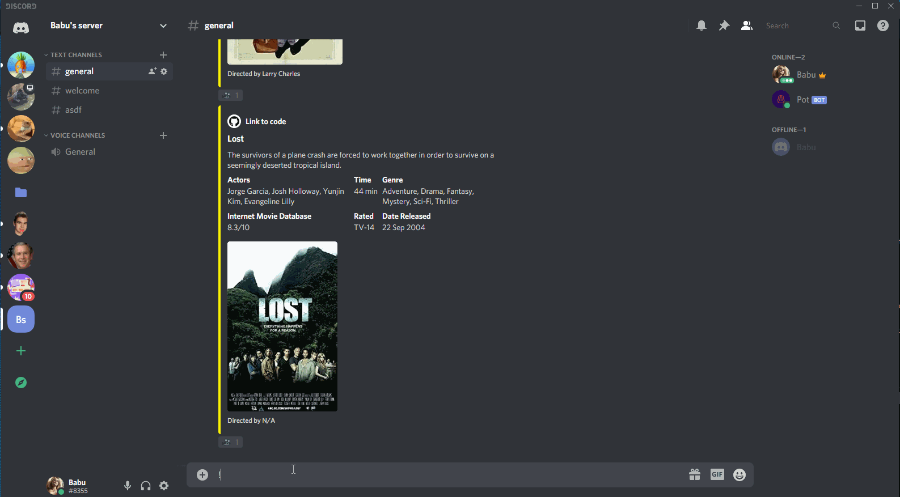

# Discord Bot
Information provider
- This bot is programmed using Discord.js connecting to the Discord API.
- Javascript with NodeJS
- Bot has several commands in which it can respond to the users based on the input the user gave.

Commands
* !Matt
* !Roll
* !Cat
* !Fact
* !Help
* !Avi
* !Movie
* !Joke
* !GL
* !Poll
